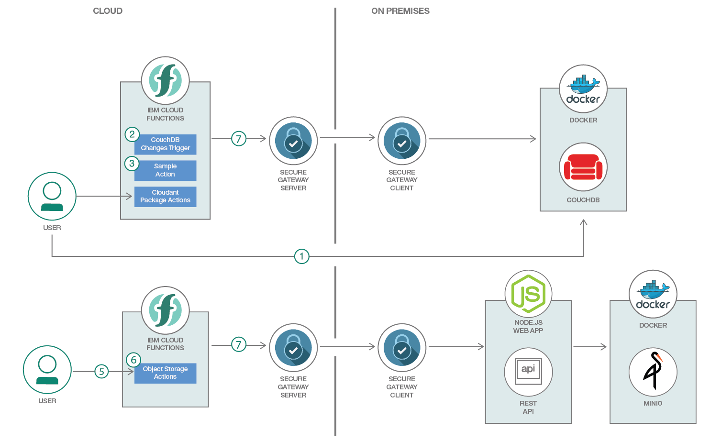
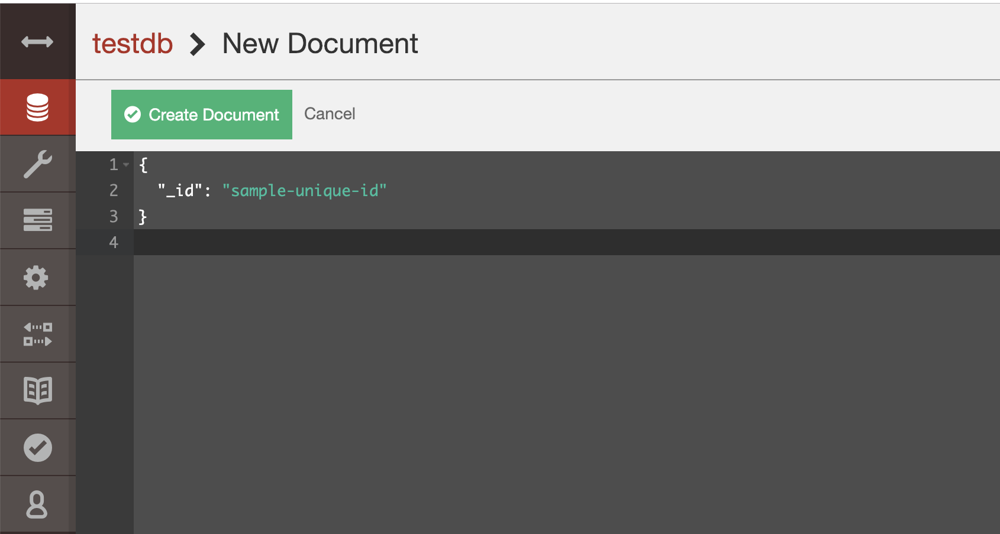
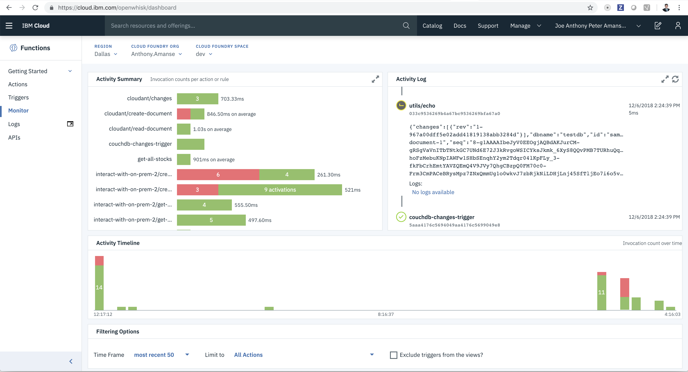
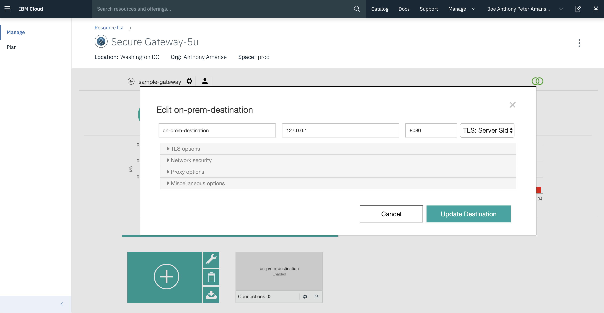

# Create serverless functions that interacts with on-premise resources

The application demonstrates [IBM Cloud Functions](https://www.ibm.com/cloud/functions) (based on Apache OpenWhisk) that interacts with on-premise resources by using [Secure Gateway](https://www.ibm.com/cloud/secure-gateway). The use case demonstrates how you can allow IBM Cloud Functions access to your on-premise resources such as databases and web applications. This code pattern uses a local CouchDB deployment that will be accessed by the serverless functions. This code pattern will also use a local Minio, an open source object storage server, and will be served through a local Node.js web application. The local resources will be exposed through a Secure Gateway tunnel.

The serverless functions for CouchDB will utilize the existing [OpenWhisk's Cloudant package](https://cloud.ibm.com/docs/openwhisk/cloudant_actions.html#cloudant_actions). This is possible since Cloudant is based on CouchDB and has almost similar [APIs](https://cloud.ibm.com/docs/services/Cloudant/api/compare.html#comparison-of-ibm-cloudant-and-couchdb-api-endpoints). An action will be triggered by changes in the database. In this case, the action will output the document ID. Other actions such as creating and reading a document can be invoked through the `wsk` command. Another scenario is executing actions via REST APIs. The actions will interact with the local Node.js web application that's using an object storage. The actions will create a bucket and an object from a URL. All the actions will utilize the Secure Gateway tunnel.

When the reader has completed this Code Pattern, they will understand how to:

* Allow Cloud Functions to access on-premise resources
* Create a Secure Gateway tunnel that will be used by serverless functions



## Flow

1. The user inserts a document on the on-premise database
2. A trigger is fired once the document was inserted in the database
3. An action connected to the trigger is invoked. The action simply prints the document ID of the inserted document
4. The user can also interact with the on-prem database via the actions available in the cloudant package
5. The user can also interact with serverless functions via REST APIs by using API Gateway that is easily integrated with IBM Cloud Functions.
6. The actions are doing http requests to the available cloud host that is exposed by the Secure Gateway service.
7. All the interaction with the on-prem database goes through a tunnel via the Secure Gateway service that is also installed in the on-prem environment.

# Steps
1. [Clone the repo](#1-clone-the-repo)
2. [Create Secure Gateway service with IBM Cloud](#2-create-secure-gateway-service-with-ibm-cloud)
3. [Run CouchDB and Minio with Docker](#3-run-couchdb-and-minio-with-docker)
4. [Deploy IBM Cloud Functions](#4-deploy-ibm-cloud-functions)
5. [Test with database events](#5-test-with-database-events)
6. [Test with REST API to access on-prem webapp](#6-test-with-rest-api-to-access-on-prem-webapp)

### 1. Clone the repo

Clone this repo locally and `cd` into the repo's directory. In a terminal, run:

```
$ git clone https://github.com/IBM/ibm-cloud-functions-with-on-prem-resources
```

### 2. Create Secure Gateway service with IBM Cloud

Create a Secure Gateway instance:

* [Secure Gateway](https://cloud.ibm.com/catalog/services/secure-gateway)

Then follow the instructions here to properly setup the connection to your on-premise resources:

* [Setting up Secure Gateway connection](secure-gateway-connection.md)

### 3. Run CouchDB and Minio with Docker

Run [couchdb](https://github.com/apache/couchdb) and [minio](https://github.com/minio/minio) in your host machine. Docker is one way of easily deploying it.

```
$ docker run -p 5984:5984 -e COUCHDB_USER=admin -e COUCHDB_PASSWORD=password --name=couchdb-test -d couchdb
```

```
$ docker run -p 9000:9000 --name minio-test \
  -e "MINIO_ACCESS_KEY=1234" \
  -e "MINIO_SECRET_KEY=12345678" \
  -v /tmp/minio-data:/data \
  -v /tmp/minio-config:/root/.minio \
  minio/minio server /data
```

Create a database named `testdb` in couchdb. Access the dashboard on `http://localhost:5984/_utils/` and enter `admin` and `password` as the username and password.

### 4. Deploy IBM Cloud Functions

First, export the Cloud Host in an environment variable that you have from your Secure Gateway destination. It would look something like: `cap-us-east-prd-sg-bm-03.integration.ibmcloud.com:15006`

```
$ export CLOUD_HOST="cap-us-east-prd-sg-bm-03.integration.ibmcloud.com:15006"
```

Then deploy the set of IBM Cloud Function resources with `wskdeploy`

```
$ wskdeploy -m manifest-couchdb.yaml
$ wskdeploy -m manifest-webapp-minio.yaml
```

### 5. Test with database events

Insert a document in couchdb using the dashboard on `http://localhost:5984/_utils/`. Insert a simple document

```
{
  "_id": "sample-document-1"
}
```


Verify that an action is triggered by the event of inserting a document in the dashboard `https://cloud.ibm.com/openwhisk/dashboard`



You can also invoke available actions from the Cloudant package. Try invoking the `create-document` action that will create a document in your local couchdb deployment.

```
$ ibmcloud wsk action invoke couchdb-binding/create-document --param dbname testdb --param doc '{"_id":"sample-document-1"}' --result

{
    "id": "sample-document-1",
    "ok": true,
    "rev": "1-967a00dff5e02add41819138abb3284d"
}

```

Read your recently created document with `read-document` action.

```
$ ibmcloud wsk action invoke couchdb-binding/read-document --param dbname testdb --param docid sample-document-1 --result

{
    "_id": "sample-document-1",
    "_rev": "1-967a00dff5e02add41819138abb3284d"
}
```

### 6. Test with REST API to access on-prem webapp

Cloud Functions can also be executed via REST APIs. The action can do http requests through the Secure Gateway's cloud host destination that would allow interaction to an on-prem web application.

The web application is a simple API server that is interfaced with a local object storage deployment. Deploy the web app using nodejs.

```
$ cd containers/webapp-minio
$ npm install
$ node app.js
```

Edit the destination for your Secure Gateway to the port 8080 which is the web application's.


Get the list of the current APIs' URL created for your actions.

```
$ ibmcloud wsk api list sample-api-gateway-create

# Result #
Action                                      Verb                   API Name  URL
/interact-with-on-pre                       post  sample-api-gateway-create  https://service.us.apiconnect.ibmcloud.com/gws/apigateway/api/<>/create/object
/interact-with-on-pre                       post  sample-api-gateway-create  https://service.us.apiconnect.ibmcloud.com/gws/apigateway/api/<>/create/bucket
```

Create a bucket for your on-prem object storage deployment using the Cloud Function's exposed REST APIs. Use the `.../create/bucket` endpoint.

```
$ export CF_API='https://service.us.apiconnect.ibmcloud.com/gws/apigateway/api/<>/create/bucket'
$ curl -X POST ''"$CF_API"'?bucketName=sample-bucket'

{"status":"Successfully created bucket"}
```

Create an object using the `.../create/object` endpoint. This accepts an image url that will be downloaded to your bucket.

```
$ export CF_API='https://service.us.apiconnect.ibmcloud.com/gws/apigateway/api/<>/create/object'
$ curl -X POST -H 'Content-type: application/json' -d '{"imageUrl":"https://newsroom.ibm.com/image/IBM+logo.jpg","bucketName":"sample-bucket","objectName":"sample-image.png"}' $CF_API

{"etag":"c9fdfac834f00bc32958384e259c4d50"}
```

Get another list of APIs.

```
$ ibmcloud wsk api list sample-api-gateway-get

# Result #
Action                                      Verb                   API Name  URL
/interact-with-on-pre                       get  sample-api-gateway-create  https://service.us.apiconnect.ibmcloud.com/gws/apigateway/api/<>/get/object
/interact-with-on-pre                       get  sample-api-gateway-create  https://service.us.apiconnect.ibmcloud.com/gws/apigateway/api/<>/get/ojbects
```

Get the list of objects in your created bucket using the `.../get/objects` endpoint.

```
$ export CF_API='https://service.us.apiconnect.ibmcloud.com/gws/apigateway/api/<>/get/objects'
$ curl ''"$CF_API"'?bucketName=sample-bucket'

[{"name":"sample-image.png","lastModified":"2018-12-06T23:15:24.000Z","etag":"c9fdfac834f00bc32958384e259c4d50","size":19292}]
```

Download the object using the `../get/object` endpoint.

```
$ export CF_API='https://service.us.apiconnect.ibmcloud.com/gws/apigateway/api/<>/get/object'
$ curl ''"$CF_API"'?bucketName=sample-bucket&objectName=sample-image.png' > sample-image.png

## You can open the sample-image.png image in your file explorer.
```

#### Clean up

You can now clean up the resources you created.

```
$ docker stop couchdb-test
$ docker stop minio-test
$ wskdeploy -m manifest-couchdb.yaml undeploy
$ wskdeploy -m manifest-webapp-minio.yaml undeploy
```

# Alternative Deployment Methods

### Deploy manually with the `ibmcloud wsk` command line tool

This approach shows you how to deploy individual the packages, actions, triggers, and rules with CLI commands. It helps you understand and control the underlying deployment artifacts.

* Export the Cloud Host in an environment variable that you have from your Secure Gateway destination. It would look something like: `cap-us-east-prd-sg-bm-03.integration.ibmcloud.com:15006`

```
$ export CLOUD_HOST="cap-us-east-prd-sg-bm-03.integration.ibmcloud.com:15006"
```

* Bind the Cloudant package

```
$ ibmcloud wsk package bind /whisk.system/cloudant couchdb-binding \
-p username admin \
-p password password \
-p host ${CLOUD_HOST}
```

* Create a Trigger to listen to database events

This will listen to changes on the `testdb` database

```
$ ibmcloud wsk trigger create couchdb-changes-trigger --feed couchdb-binding/changes \
--param dbname testdb
```

* Create a Rule

The rule connects the trigger to an action.

```
$ ibmcloud wsk rule create couchdb-trigger-rule couchdb-changes-trigger /whisk.system/utils/echo
```

This connects the trigger to a simple `echo` action that just outputs the input which would be the database event.

* Create the actions

Create a package to organize the actions that will be created for this repo.

```
$ ibmcloud wsk package create interact-with-on-prem
$ ibmcloud wsk package create interact-with-on-prem-2
```

Create actions that interact with the web app

```
$ ibmcloud wsk action create interact-with-on-prem-2/get-object-request actions/get-object.js \
--kind nodejs:8 \
--param CLOUD_HOST $CLOUD_HOST

$ ibmcloud wsk action create interact-with-on-prem-2/get-bucket-request actions/get-bucket-objects.js \
--kind nodejs:8 \
--param CLOUD_HOST $CLOUD_HOST

$ ibmcloud wsk action create interact-with-on-prem-2/create-bucket-request actions/create-bucket.js \
--kind nodejs:8 \
--param CLOUD_HOST $CLOUD_HOST

$ ibmcloud wsk action create interact-with-on-prem-2/create-object-request actions/create-object.js \
--kind nodejs:8 \
--param CLOUD_HOST $CLOUD_HOST
```

* Create REST APIs

```
$ ibmcloud wsk api create /get /object get interact-with-on-prem-2/get-object-request -n sample-api-gateway-get --response-type http
$ ibmcloud wsk api create /get /objects get interact-with-on-prem-2/get-bucket-request -n sample-api-gateway-get --response-type http
$ ibmcloud wsk api create /create /bucket post interact-with-on-prem-2/create-bucket-request -n sample-api-gateway-create --response-type http
$ ibmcloud wsk api create /create /object post interact-with-on-prem-2/create-object-request -n sample-api-gateway-create --response-type http
```

You can now proceed to the [next step](#5-test-with-database-events).

* To delete them later:

```
$ ibmcloud wsk trigger delete couchdb-changes-trigger
$ ibmcloud wsk rule delete couchdb-trigger-rule
$ ibmcloud wsk package delete couchdb-binding
$ ibmcloud wsk package delete interact-with-on-prem
$ ibmcloud wsk action delete interact-with-on-prem-2/get-object-request
$ ibmcloud wsk action delete interact-with-on-prem-2/get-bucket-request
$ ibmcloud wsk action delete interact-with-on-prem-2/create-object-request
$ ibmcloud wsk action delete interact-with-on-prem-2/create-bucket-request
$ ibmcloud wsk api delete sample-api-gateway-get
$ ibmcloud wsk api delete sample-api-gateway-create
$ ibmcloud wsk package delete interact-with-on-prem-2
```

## License

This code pattern is licensed under the Apache License, Version 2. Separate third-party code objects invoked within this code pattern are licensed by their respective providers pursuant to their own separate licenses. Contributions are subject to the [Developer Certificate of Origin, Version 1.1](https://developercertificate.org/) and the [Apache License, Version 2](http://www.apache.org/licenses/LICENSE-2.0.txt).

[Apache License FAQ](http://www.apache.org/foundation/license-faq.html#WhatDoesItMEAN)