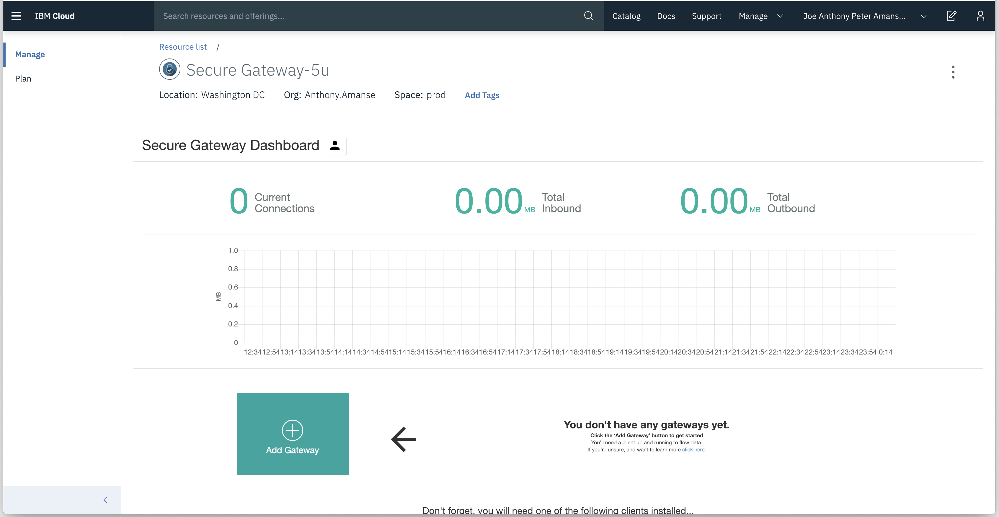
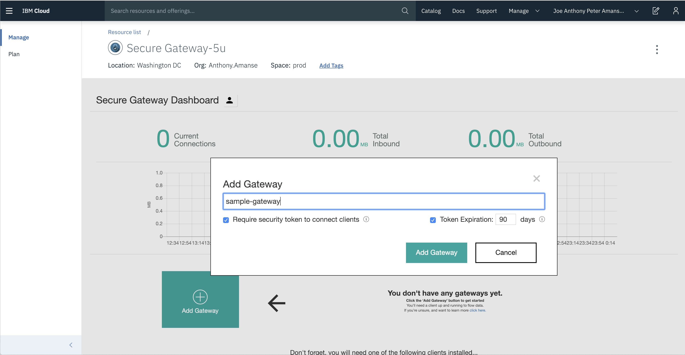
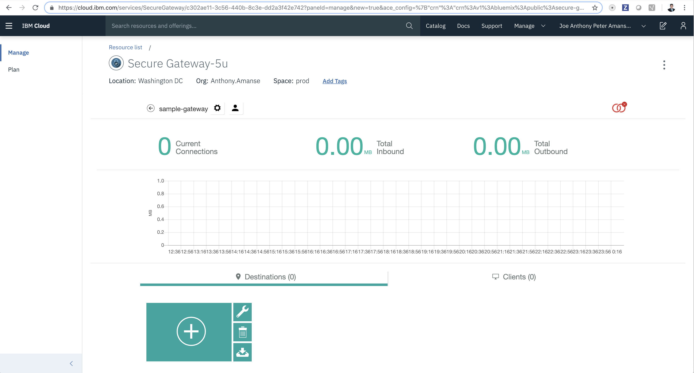
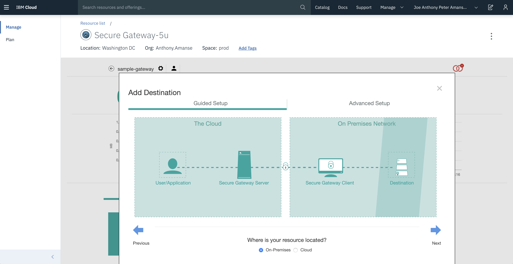
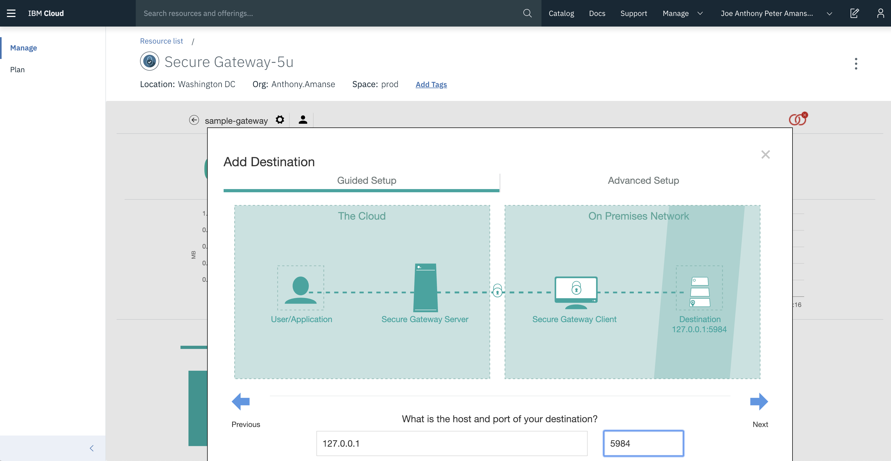
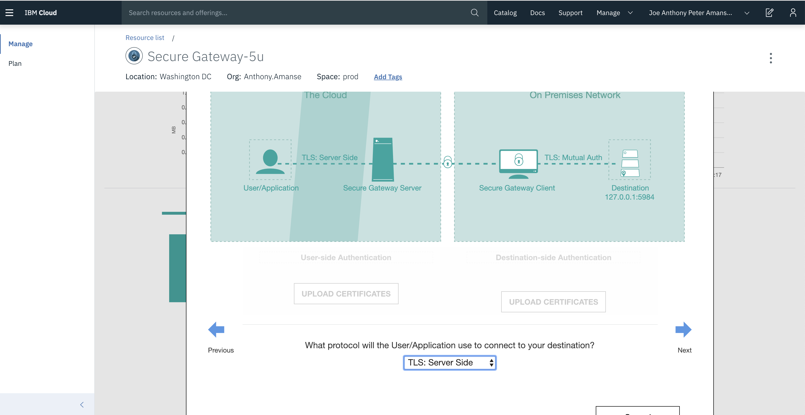
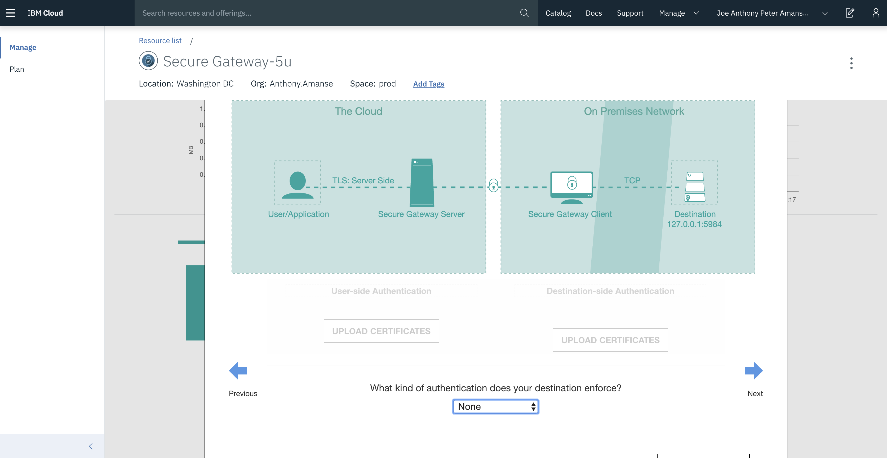
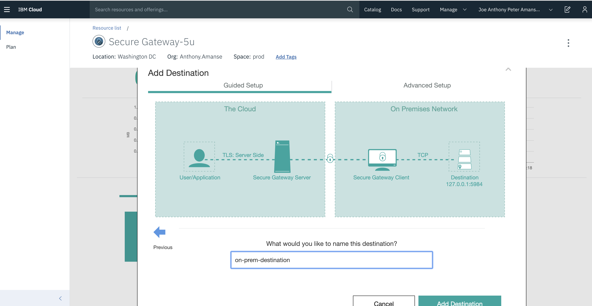
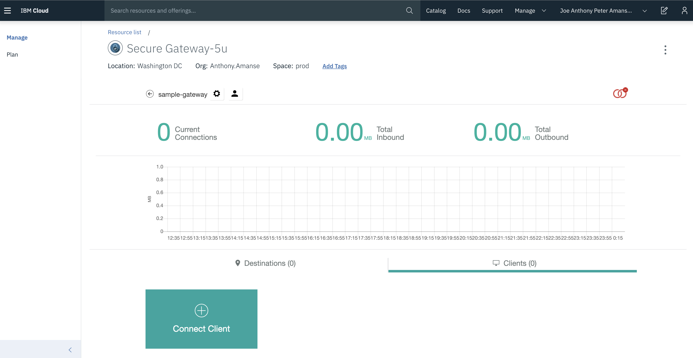
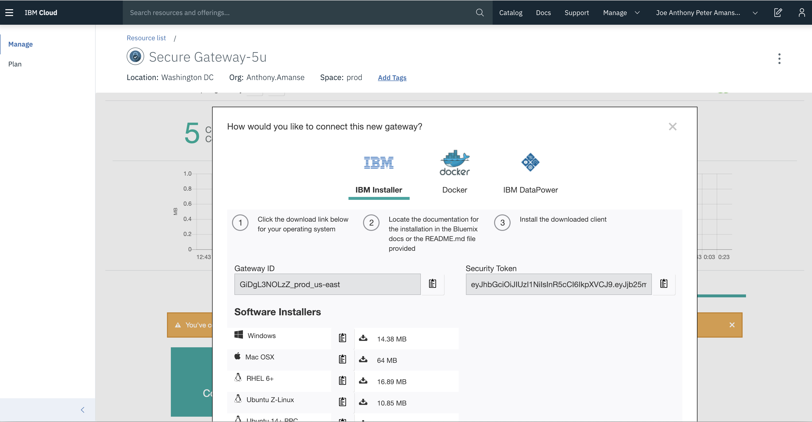

# Setting up Secure Gateway

1. Add a Gateway and name it `sample-gateway`




2. On the Destinations tab, add a Destination through Guided Setup. Choose `On-premise` for your resource location and click next.




3. For the host and port, use `127.0.0.1` and `5984` (CouchDB's port) then click on next.



4. Choose `TLS: Server Side` for the application's protocol use to the destination then click on next.



5. Choose `None` for the authentication of the destination then click on next. Add nothing to the IP tables then click on next.




6. Then name the destination `on-prem-destination` then click on `Add Destination`.



7. Take note of the `Cloud Host : Port`. You will use this later in the step of creating your serverless functions.


8. On the Clients tab, click on Connect Client and download the appropiate installer for your system. Then run the Secure Gateway Client and enter your Gateway ID and Security Token.




9. Add ACL (Access Control List) rules by running this in your Secure Gateway Client:

```
acl allow 127.0.0.1:5984
acl allow 127.0.0.1:8080
```

This allows the secure gateway to connect to either your local CouchDB or Node.js web app.